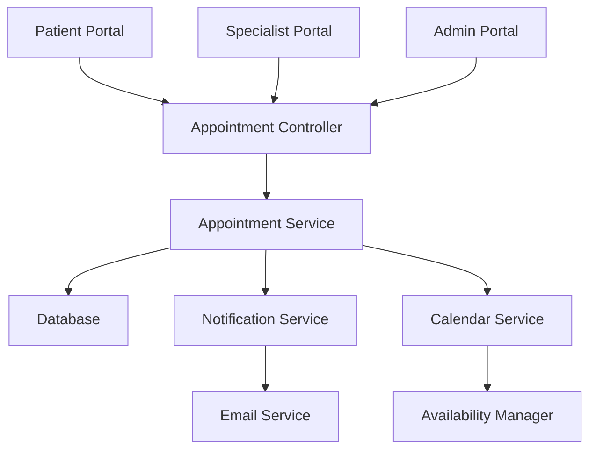

# Design Document: Appointment Management System

## Overview

The Appointment Management System is designed to enhance the Sapyyn Patient Referral System by providing comprehensive appointment scheduling, tracking, and management capabilities. This system will integrate with the existing referral workflow, allowing patients to book appointments with specialists based on their referrals, enabling providers to manage their availability, and providing administrators with oversight of the entire appointment process.

This design document outlines the technical architecture, data models, user interfaces, and implementation strategies for the appointment management system.

## Architecture

The Appointment Management System follows a layered architecture pattern:

1. **Database Layer**: Stores appointment data, availability, and related information
2. **Service Layer**: Handles business logic for appointment scheduling, notifications, and management
3. **Controller Layer**: Processes HTTP requests for appointment CRUD operations
4. **View Layer**: Renders appointment-related templates and interfaces

### System Components



## Components and Interfaces

### Database Schema

#### `appointments` Table
- `id` (UUID): Primary key
- `patient_id` (UUID): Foreign key to users table
- `specialist_id` (UUID): Foreign key to users table
- `referral_id` (UUID): Foreign key to referrals table (optional)
- `title` (VARCHAR): Title/purpose of the appointment
- `description` (TEXT): Detailed description or reason for appointment
- `start_time` (TIMESTAMP): Start time of the appointment
- `end_time` (TIMESTAMP): End time of the appointment
- `status` (ENUM): Status of the appointment (SCHEDULED, COMPLETED, CANCELED, NO_SHOW)
- `notes` (TEXT): Notes added by the specialist after the appointment
- `created_by` (UUID): User who created the appointment
- `created_at` (TIMESTAMP): Creation timestamp
- `updated_at` (TIMESTAMP): Last update timestamp

#### `availability` Table
- `id` (UUID): Primary key
- `specialist_id` (UUID): Foreign key to users table
- `day_of_week` (INTEGER): Day of the week (0-6, where 0 is Monday)
- `start_time` (TIME): Start time of availability window
- `end_time` (TIME): End time of availability window
- `is_recurring` (BOOLEAN): Whether this is a recurring availability
- `specific_date` (DATE): Specific date for non-recurring availability
- `created_at` (TIMESTAMP): Creation timestamp
- `updated_at` (TIMESTAMP): Last update timestamp

#### `appointment_notifications` Table
- `id` (UUID): Primary key
- `appointment_id` (UUID): Foreign key to appointments table
- `user_id` (UUID): Foreign key to users table
- `notification_type` (ENUM): Type of notification (CONFIRMATION, REMINDER, UPDATE, CANCELLATION)
- `sent_at` (TIMESTAMP): When the notification was sent
- `delivery_status` (ENUM): Status of the notification delivery (SENT, DELIVERED, FAILED)

### Service Interfaces

#### AppointmentService
```python
class AppointmentService:
    def create_appointment(self, appointment_data):
        """Create a new appointment"""
        
    def update_appointment(self, appointment_id, appointment_data):
        """Update an existing appointment"""
        
    def get_appointment(self, appointment_id):
        """Get an appointment by ID"""
        
    def list_appointments(self, filters=None):
        """List appointments with optional filters"""
        
    def cancel_appointment(self, appointment_id, cancellation_reason=None):
        """Cancel an appointment"""
        
    def complete_appointment(self, appointment_id, notes=None):
        """Mark an appointment as completed"""
        
    def get_available_slots(self, specialist_id, date):
        """Get available time slots for a specialist on a specific date"""
        
    def check_appointment_conflicts(self, specialist_id, start_time, end_time):
        """Check for appointment conflicts"""
        
    def get_appointments_by_referral(self, referral_id):
        """Get appointments associated with a referral"""
        
    def get_upcoming_appointments(self, user_id, role):
        """Get upcoming appointments for a user based on their role"""
```

#### AvailabilityService
```python
class AvailabilityService:
    def set_availability(self, specialist_id, availability_data):
        """Set availability for a specialist"""
        
    def get_availability(self, specialist_id, date=None):
        """Get availability for a specialist"""
        
    def remove_availability(self, availability_id):
        """Remove an availability slot"""
        
    def get_available_specialists(self, date, specialty=None):
        """Get specialists available on a specific date"""
```

#### NotificationService
```python
class NotificationService:
    def send_appointment_confirmation(self, appointment_id):
        """Send appointment confirmation notifications"""
        
    def send_appointment_reminder(self, appointment_id):
        """Send appointment reminder notifications"""
        
    def send_appointment_update(self, appointment_id, update_type):
        """Send appointment update notifications"""
        
    def send_appointment_cancellation(self, appointment_id, cancellation_reason=None):
        """Send appointment cancellation notifications"""
```

### Controller Interfaces

#### AppointmentController
```python
class AppointmentController:
    def list_appointments(self):
        """Handle GET request to list appointments"""
        
    def create_appointment(self):
        """Handle POST request to create an appointment"""
        
    def view_appointment(self, appointment_id):
        """Handle GET request to view an appointment"""
        
    def update_appointment(self, appointment_id):
        """Handle POST request to update an appointment"""
        
    def cancel_appointment(self, appointment_id):
        """Handle POST request to cancel an appointment"""
        
    def complete_appointment(self, appointment_id):
        """Handle POST request to complete an appointment"""
        
    def get_available_slots(self):
        """Handle GET request to get available time slots"""
```

#### AvailabilityController
```python
class AvailabilityController:
    def manage_availability(self):
        """Handle GET/POST requests for availability management"""
        
    def set_availability(self):
        """Handle POST request to set availability"""
        
    def remove_availability(self, availability_id):
        """Handle POST request to remove availability"""
```

## Data Models

### Appointment Model
```python
class Appointment:
    id: UUID
    patient_id: UUID
    specialist_id: UUID
    referral_id: UUID  # Optional
    title: str
    description: str
    start_time: datetime
    end_time: datetime
    status: AppointmentStatus
    notes: str  # Optional
    created_by: UUID
    created_at: datetime
    updated_at: datetime
    
    # Relationships
    patient: User
    specialist: User
    referral: Referral  # Optional
    notifications: List[AppointmentNotification]
```

### Availability Model
```python
class Availability:
    id: UUID
    specialist_id: UUID
    day_of_week: int  # 0-6, where 0 is Monday
    start_time: time
    end_time: time
    is_recurring: bool
    specific_date: date  # Optional, for non-recurring availability
    created_at: datetime
    updated_at: datetime
    
    # Relationships
    specialist: User
```

### AppointmentStatus Enum
```python
class AppointmentStatus(Enum):
    SCHEDULED = "scheduled"
    COMPLETED = "completed"
    CANCELED = "canceled"
    NO_SHOW = "no_show"
```

### NotificationType Enum
```python
class NotificationType(Enum):
    CONFIRMATION = "confirmation"
    REMINDER = "reminder"
    UPDATE = "update"
    CANCELLATION = "cancellation"
```

## Error Handling

### Error Types
1. **ValidationError**: Raised when appointment data fails validation
2. **ConflictError**: Raised when there's a scheduling conflict
3. **NotFoundError**: Raised when a requested appointment doesn't exist
4. **AuthorizationError**: Raised when a user doesn't have permission

### Error Handling Strategy
- All errors will be logged with appropriate context
- User-friendly error messages will be displayed in the UI
- API endpoints will return appropriate HTTP status codes
- Validation errors will include specific field information

## Testing Strategy

### Unit Tests
- Test appointment creation and validation
- Test availability management
- Test conflict detection
- Test notification generation

### Integration Tests
- Test appointment workflow from creation to completion
- Test notification delivery
- Test integration with referral system

### End-to-End Tests
- Test appointment booking as a patient
- Test appointment management as a specialist
- Test appointment oversight as an administrator

## User Interface Design

### Patient Appointment Booking


The patient appointment booking interface will include:
- Specialist selection based on referrals
- Calendar view of available dates
- Time slot selection
- Appointment details form
- Confirmation screen

### Specialist Calendar


The specialist calendar interface will include:
- Week/month view of appointments
- Availability management
- Appointment details on click
- Actions for each appointment (complete, reschedule, cancel)
- Notes and outcome recording

### Administrator Dashboard


The administrator dashboard will include:
- Overview of all appointments
- Filtering by specialist, status, date range
- Analytics and metrics
- Conflict resolution tools
- Manual appointment management

## Implementation Plan

1. **Database Setup**: Create the necessary tables and indexes
2. **Core Services**: Implement appointment and availability services
3. **Controllers**: Build the appointment and availability controllers
4. **Patient UI**: Create the patient appointment booking interface
5. **Specialist UI**: Build the specialist calendar and appointment management interface
6. **Admin UI**: Develop the administrator oversight dashboard
7. **Notification System**: Implement appointment notifications
8. **Analytics Integration**: Connect appointment data to the analytics system
9. **Testing**: Implement comprehensive test suite

## Security Considerations

1. **Access Control**: Ensure users can only access appointments they are authorized to view
2. **Data Protection**: Protect sensitive patient information in appointment details
3. **Audit Trail**: Log all appointment-related actions for compliance
4. **Input Validation**: Validate all user inputs to prevent injection attacks
5. **Rate Limiting**: Apply rate limits to prevent abuse of booking system

## Integration Points

### Referral System Integration
- Appointments will be linked to referrals when applicable
- Referral status will be updated based on appointment status
- Referral analytics will include appointment conversion metrics

### Notification System Integration
- Appointment events will trigger notifications
- Users will be able to set notification preferences for appointments
- Notification delivery will be tracked and logged

### Analytics Integration
- Appointment data will feed into the analytics system
- Key metrics will include booking rates, completion rates, and no-show rates
- Appointment analytics will be included in nightly summary reports

## Performance Considerations

1. **Indexing**: Proper indexing of appointment and availability tables for efficient queries
2. **Caching**: Cache frequently accessed data like specialist availability
3. **Pagination**: Implement pagination for appointment listings
4. **Asynchronous Processing**: Handle notifications asynchronously to improve response times
5. **Query Optimization**: Optimize complex queries for appointment filtering and reporting