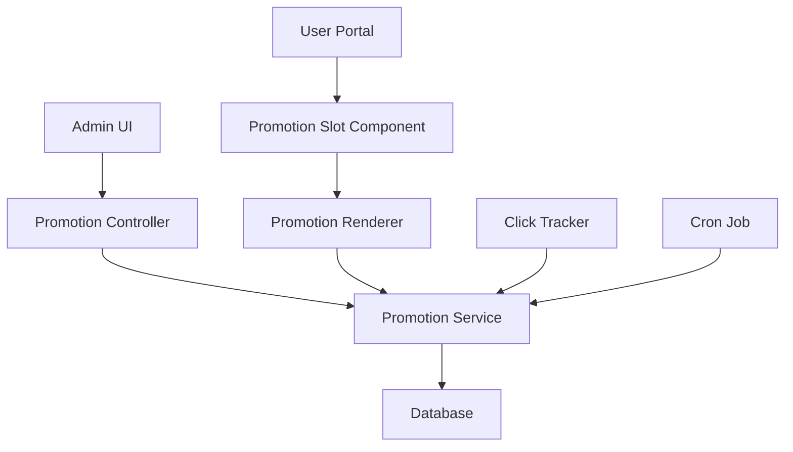

# Design Document: Promotional-Partner / Ad-Space Module

## Overview

The Promotional-Partner / Ad-Space Module is designed to enable dental practices to monetize their portal by displaying targeted promotional content from partners while maintaining HIPAA compliance. The system will support creating, managing, displaying, and tracking promotional content across various locations within the application.

This design document outlines the technical architecture, data models, user interfaces, and implementation strategies for the promotional partner system.

## Architecture

The Promotional-Partner module follows a layered architecture pattern:

1. **Database Layer**: Stores promotion data, targeting rules, and performance metrics
2. **Service Layer**: Handles business logic for promotion selection, tracking, and management
3. **Controller Layer**: Processes HTTP requests for admin CRUD operations and user interactions
4. **View Layer**: Renders promotions in designated slots and provides admin interfaces

### System Components



## Components and Interfaces

### Database Schema

#### `promotions` Table
- `id` (UUID): Primary key
- `title` (VARCHAR): Title of the promotion
- `description` (TEXT): Optional description
- `image_url` (VARCHAR): Path to the promotion image
- `target_url` (VARCHAR): Destination URL when clicked
- `location` (ENUM): Placement location (DASHBOARD_TOP, DASHBOARD_SIDEBAR, etc.)
- `start_date` (TIMESTAMP): When to start showing the promotion
- `end_date` (TIMESTAMP): When to stop showing the promotion
- `is_active` (BOOLEAN): Whether the promotion is currently active
- `impression_count` (INTEGER): Number of times the promotion was displayed
- `click_count` (INTEGER): Number of times the promotion was clicked
- `created_at` (TIMESTAMP): Creation timestamp
- `updated_at` (TIMESTAMP): Last update timestamp

#### `promotion_roles` Table
- `id` (UUID): Primary key
- `promotion_id` (UUID): Foreign key to promotions table
- `role` (VARCHAR): User role that can see this promotion
- `created_at` (TIMESTAMP): Creation timestamp

#### `user_promotion_preferences` Table
- `user_id` (UUID): Foreign key to users table
- `opt_out` (BOOLEAN): Whether user has opted out of targeted promotions
- `updated_at` (TIMESTAMP): Last update timestamp

### Service Interfaces

#### PromotionService
```python
class PromotionService:
    def create_promotion(self, promotion_data):
        """Create a new promotion"""
        
    def update_promotion(self, promotion_id, promotion_data):
        """Update an existing promotion"""
        
    def get_promotion(self, promotion_id):
        """Get a promotion by ID"""
        
    def list_promotions(self, filters=None):
        """List promotions with optional filters"""
        
    def delete_promotion(self, promotion_id):
        """Delete a promotion"""
        
    def toggle_promotion_status(self, promotion_id, is_active):
        """Activate or deactivate a promotion"""
        
    def get_promotion_for_location(self, location, user=None):
        """Get an appropriate promotion for the given location and user"""
        
    def record_impression(self, promotion_id):
        """Increment impression count for a promotion"""
        
    def record_click(self, promotion_id):
        """Increment click count for a promotion"""
        
    def expire_outdated_promotions(self):
        """Deactivate promotions past their end date"""
```

#### ImageService
```python
class ImageService:
    def validate_promotion_image(self, image_file):
        """Validate promotion image size and format"""
        
    def save_promotion_image(self, image_file):
        """Save promotion image and return the URL"""
```

### Controller Interfaces

#### Admin Promotion Controller
```python
class AdminPromotionController:
    def list_promotions(self):
        """Handle GET request to list promotions"""
        
    def create_promotion(self):
        """Handle POST request to create a promotion"""
        
    def edit_promotion(self, promotion_id):
        """Handle GET/POST requests to edit a promotion"""
        
    def delete_promotion(self, promotion_id):
        """Handle DELETE request to remove a promotion"""
        
    def toggle_status(self, promotion_id):
        """Handle POST request to toggle promotion status"""
```

#### User-Facing Promotion Controller
```python
class PromotionController:
    def get_promotion(self, location):
        """Handle API request to get a promotion for a location"""
        
    def record_click(self, promotion_id):
        """Handle redirect request when a promotion is clicked"""
        
    def update_preferences(self):
        """Handle request to update promotion preferences"""
```

## Data Models

### Promotion Model
```python
class Promotion:
    id: UUID
    title: str
    description: str
    image_url: str
    target_url: str
    location: PromotionLocation
    start_date: datetime
    end_date: datetime
    is_active: bool
    impression_count: int
    click_count: int
    allowed_roles: List[str]
    created_at: datetime
    updated_at: datetime
    
    @property
    def click_through_rate(self):
        """Calculate click-through rate"""
        if self.impression_count == 0:
            return 0
        return self.click_count / self.impression_count
```

### PromotionLocation Enum
```python
class PromotionLocation(Enum):
    DASHBOARD_TOP = "dashboard_top"
    DASHBOARD_SIDEBAR = "dashboard_sidebar"
    DOCUMENTS_BANNER = "documents_banner"
    REFERRALS_PAGE = "referrals_page"
    PROFILE_PAGE = "profile_page"
```

## Error Handling

### Error Types
1. **ValidationError**: Raised when promotion data fails validation
2. **ImageError**: Raised when an image fails size or format validation
3. **NotFoundError**: Raised when a requested promotion doesn't exist
4. **AuthorizationError**: Raised when a user doesn't have permission

### Error Handling Strategy
- All errors will be logged with appropriate context
- User-friendly error messages will be displayed in the UI
- API endpoints will return appropriate HTTP status codes
- Validation errors will include specific field information

## Testing Strategy

### Unit Tests
- Test promotion creation and validation
- Test promotion selection logic
- Test impression and click tracking
- Test role-based filtering

### Integration Tests
- Test database operations
- Test image upload and validation
- Test promotion expiration cron job

### End-to-End Tests
- Test admin CRUD operations
- Test promotion display in different locations
- Test click tracking and redirection
- Test opt-out functionality

### Performance Tests
- Test promotion selection performance under load
- Test concurrent impression/click tracking

## User Interface Design

### Admin Promotion List


The admin promotion list will include:
- Table of all promotions with columns for title, location, status, date range, impressions, clicks, and CTR
- Filters for status, location, and date range
- Create, edit, and delete actions
- Toggle for activation/deactivation

### Promotion Creation/Edit Form


The promotion form will include:
- Title and description fields
- Image upload with preview
- Target URL field
- Location selector
- Date range picker
- Role selector (multi-select)
- Active/inactive toggle

### User-Facing Promotion Slot


The promotion slot will include:
- Responsive container that adapts to the placement location
- Clearly labeled "Sponsored" indicator
- Image with appropriate alt text
- Click tracking
- Accessible hover state

### User Preferences


The user preferences section will include:
- Toggle for opting out of targeted promotions
- Clear explanation of what opting out means
- Save button with confirmation

## HIPAA Compliance Considerations

1. **Data Separation**: Ensure no PHI (Protected Health Information) is associated with promotion tracking
2. **URL Parameters**: Strip any identifiable information from redirect URLs
3. **Audit Logging**: Maintain logs of all promotion management actions
4. **Role-Based Access**: Restrict promotion management to authorized administrators
5. **User Consent**: Provide clear opt-out mechanisms for targeted content

## Implementation Plan

1. **Database Setup**: Create the necessary tables and indexes
2. **Backend Services**: Implement promotion service and image handling
3. **Admin UI**: Build the CRUD interfaces for promotion management
4. **Promotion Component**: Create the reusable promotion slot component
5. **Tracking System**: Implement impression and click tracking
6. **Cron Job**: Set up automated expiration of outdated promotions
7. **User Preferences**: Add promotion preferences to user settings
8. **Testing**: Implement comprehensive test suite
9. **Documentation**: Update system documentation

## Security Considerations

1. **Input Validation**: Validate all user inputs to prevent injection attacks
2. **Image Validation**: Scan uploaded images for malware
3. **URL Validation**: Ensure target URLs are properly formatted and safe
4. **Access Control**: Implement proper authorization checks for admin functions
5. **Rate Limiting**: Apply rate limits to prevent abuse of tracking endpoints